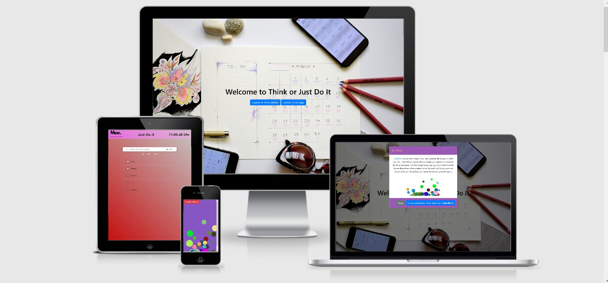

<h1 align="center">Moe Portfolio</h1>


[Click here to view the ToThink or ToDo project.](https://alashtal.github.io/Just-Do-it_App_or_ToThink_Ballzz/)
[Moe's portfolio.(not yet updated)](https://alashtal.github.io/M-O-E_Portfolio/)

<h2 align="center"></h2>
Hello world =)
<strong>Welcome to Think or Just-do-it app. </strong> 
This repo contains an application helps people write down tasks, filter them
based on them being done or not OR helps them to find things to add to their to-do list, meaning gives them time to think in hypnotizing jumping balls.  ¯\_(ツ)_/¯.
 
## UX (User Experience)
 This website is desigened to be responsive on a range of devices which is smooth to navigate for potential people seeking a to-do app or fun way for spacing out and it showcases the developers skill in javascript, the main focus for the website’s owner is to present his app for other people to help them write down tasks and manifest their ideas digitally.
 Potential website visitors can simply add their tasks or space-out a little bit in a fun GUI.

- ### User stories

  - A user can add tasks to the app.
  - A user can filter the task to see which one are open, done or both.
  - To be able to effortlessly navigate the website to find the right web application.
  - To be able to find information about the app, through the modal.
  - To be able to zone-out or to gaze at the (hypnotizing) balls.

- ### Design

  - #### Image:

    - The image I found on (pixabay) represents what I tryiec to create digitally.
      It's well taken, with a clean mess around.

  - #### Color:

    - The color used are colormap linear gradient of the color schemes purple, white and blue and at most of the design purple is the color progression dominant.
      I choose the color purple because it's often assosiated with wisdom, creativity and magic.Purple as well is the balancing color between red and blue’s color psychologies, and while red brings energy to the color, blue brings relaxation and stability, together they make purple the perfect balance of the two.
      [Color Psychology](http://www.artitudesdesign.com/purple-color-psychology/) says that it “can have calming effects over the mind and nerves, it can be uplifting and can trigger creativity.”
    - Color inspired from [dribble](https://dribbble.com).

  - #### Typography:

    - The sexy fonts used within the website are Exo and Roboto fonts. Sans Serif font is used a well as a fallback font if the browser is not compatible with the fonts.

    - ### Wireframes
    - Desktop Orginal Idea Wireframes
    - [Main Index Webpage](<assets/>wireframes/index.html.png>)
    - [The ToThink section (jumping balls)](assets/wireframes/ballzZz.html.png)
    - [The just-do-it section (To-do App)](assets/wireframes/just-to-do.html.png)

    - Mobile Wireframes
      - [Main Page](assets/wireframes/iphone_index.html.png)
      - [About Page](assets/wireframes/iphone_to-do.html.png)

## Features

### Features Left to Implement

- #### Gallery for showcasing projects:

  - This will be a section of different hero images of my projects with a hyperlink linked to them. It will include some animation or JavaScript as well.

- #### Hosting the project in a domain:

  - I will find a hosting platform, optain a domain as well to make the project official and most importantly to have a bigger playground to play with and add more functionality.

- #### Live Chat Plugin:

  - I will use [drift](https://www.drift.com) API, for recruiter to chat with me when I'm available, if not all messages will be forwared to me.

- #### Functionalty contact form:
  - The contact form will be linked to an email after optaining a domain of course.

### Existing Features

- #### Responsive on all device sizes and Interactive elements

  - Hovering on buttons or navs item, its responded by changing the color making it clear that this item can be clicked.
  - Typography/imagery should resize for appealing look on the devices.
  - The navigation bar collapses to a burger icon when using smaller screens.

- #### Clickable logo which takes you home at any time + navigation bar for quick navigation within the website.

  - When Clicking the navigation bar on About Me, it adds the home button in the nav bar while before it doesn't exist.

- #### Details about the developer skilss.

  - The well-organized and descriptive information allows the user to find the necessary details about the skils of the developer in the about me page.

- #### Say Hello =).

  - The page should allow the user to contact the website’s company or Sign-up/Subscribe to the newsletter by having them fill out their details

- #### Clickable text (Coffee is On me).

  - When Clicking the text it will take the user to contact me page.

- #### Social media accounts buttons.
  - The social media icons in the footer should allow the user to visit the developer's account for further information or communication.

## Technologies Used

### Languages Used

- [HTML5](https://www.w3schools.com/html/html_intro.asp)
- [CSS3](https://www.w3schools.com/css/)
- [JS](https://www.javascript.com/)

### Frameworks, Libraries & Programs Used

1. [Animate.CSS:](https://animate.style)
   - Animate.CSS is a library of ready-to-use, cross-browser animations for you to use in your projects.
1. [Bootstrap 4.5:](https://getbootstrap.com/)
   - Bootstrap was used to assist with the responsiveness and styling of the website.
1. [GitPod:](https://gitpod.io)
   - Gitpod was used as an IDE to create and temporary view the website.
1. [WOW.Js:](https://wowjs.uk)
   - wow.js is a JavaScript plugin that reveals animations when you scroll.
1. [CSS Tricks](https://css-tricks.com/css-animation-libraries/)

   # -Used to inspired designs and code understanding as well such as creating a variable like :root.

   -Used to inspired designs and code understanding as well such as creating a variable like :root.

   > > > > > > > 027813d7af8003ffa38c50a835bef70a07268669

1. [Templatemo:](https://templatemo.com)
   - Used to downloand the edited theme of the website, the theme is Blaster a very eye catchy theme.
1. [Hover.CSS:](https://ianlunn.github.io/Hover/)
   - Hover.css was used on the Social Media icons in the footer to add the float transition while being hovered over.
1. [Google Fonts:](https://fonts.google.com/)
   - Google fonts were used to import the 'Titillium Web' font into the style.css file which is used on all pages throughout the project.
1. [Font Awesome:](https://fontawesome.com/)
   - Font Awesome was used within the whole website to add icons for aesthetic's.
1. [jQuery:](https://jquery.com/)
   - jQuery came with Bootstrap to make the navbar responsive but was also used for the smooth scroll function in JavaScript.
1. [Canva:](https://www.canva.com/)
   - I used Canva to create the logo and size my profile image.
1. [Balsamiq:](https://balsamiq.com/)
   - Balsamiq used to create the design wireframes.
1. [Git](https://git-scm.com/)
   - Git was used for version control by utilizing the Gitpod terminal to commit to Git and Push to GitHub.
1. [GitHub:](https://github.com/)
   - GitHub is used to store the projects code after being pushed from Git.
   - Code-Institute’s [Gitpod-Full-Template](https://github.com/Code-Institute-Org/gitpod-full-template) repository was used to install the helpful extensions for the Gitpod workspace.

## Testing

The W3C Markup Validator and W3C CSS Validator Services were used to validate every page of the project to ensure there were no syntax errors in the project.

- Inspect element (dev tools, was my secert best weapon).
- [Am I responsive](http://ami.responsivedesign.is/)
- [W3C Markup Validator](https://jigsaw.w3.org/css-validator/#validate_by_input)
- [W3C CSS Validator](https://jigsaw.w3.org/css-validator/#validate_by_input)

### Testing User Stories from User Experience (UX) Section

- As a Visitor, I want to easily understand the main purpose of the site and learn more about the developer.

  1.  When Entering the site users are automatically greeted with a clean and easily readable navigation bar to go to the page of their choice. Underneath there is a Hero Image with Text and a button that takes you to the footer.
  2.  The main points are concluded immediately within the hero image and the short text provided.
  3.  The navigation bar has the “About me” link that takes the user to the About section for more information about the developer and what they’re capable of.

- I want to smoothly navigate through the site to find information.

  1.  The users have three options:

      1.  Click the call to action button that takes to a another tab with the CV presented in PDF.
      2.  The navigation bar items that takes them to their section of choice, and in small devices clicking on the burger icon drops down the hidden navigation items. User has the about me section to get to know the developer and the Say Hello section too.
      3.  Scroll down to explore the different website’s sections.

  2.  I want to be able to find information about the developer's skilss.

      1.  I want to know what languages the developer knows and what Technologies he can use.
      2.  I want to know what idea's he's capable of Implementing.
      3.  I want to see projects previously done by the developer to identify what is the specturm of his skills (Coming soon).

  3.  I want to be able to contact the developer for a project idea.

      1.  In the Say hello section you will be able to contact the developer.
      2.  Another way for communication is clicking on the social media links below in the footer of every page.

### Fixed bugs

- I had duplicated sections in the css which I fixed by a comma and duplicated

## Deployment

### GitHub Pages

The project was deployed to GitHub Pages using the following steps...

1. Log in to GitHub and locate the [GitHub Repository](https://alashtal.github.io/Just-Do-it_App_or_ToThink_Ballzz/)
2. At the top of the Repository (not top of page), locate the "Settings" Button on the menu.
3. Scroll down the Settings page until you locate the "GitHub Pages" Section.
4. Under "Source", click the dropdown called "None" and select "Master Branch".
5. The page will automatically refresh.
6. Scroll back down through the page to locate the now published site [link](https://alashtal.github.io/Just-Do-it_App_or_ToThink_Ballzz/) in the "GitHub Pages" section.

### Making a Local Clone

1. Log in to GitHub and locate the [GitHub Repository](https://alashtal.github.io/Just-Do-it_App_or_ToThink_Ballzz/)
2. Under the repository name, click "Clone or Download".
3. To clone the repository using HTTPS, under "Clone with HTTPS", copy the link.
4. Open Git Bash
5. Change the current working directory to the location where you want the cloned directory to be made.
6. Type `git clone`, and then paste the URL you copied in Step 3.

```
$ git clone https://github.com/alashtal/M-O-E_Portfolio
```

7. Go to the clone folder and double click on the index.html to load the website.

## Credits

### Content

- Content was written by the programmer.
- README File content was used from [Code Institute README Sample](https://github.com/Code-Institute-Solutions/SampleREADME/blob/master/README.md)

### Media

- Hero Image:
  - [To-Do](assets/images/todoimage.jpg) (Hero image was taken from [here](https://pixabay.com/photos/planner-plan-planning-to-do-3485976/) )

### Acknowledgements

- I'm very grateful and thankful for my mentor @Maranatha Ilesanmi, Mark Mcgann, Lucy Rush and all the student care team.
